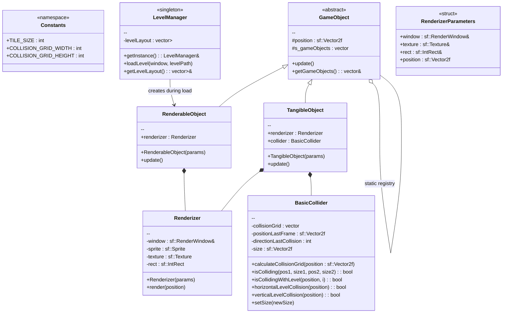

```mermaid
classDiagram

class Constants {
    <<namespace>>
    +TILE_SIZE : int
    +COLLISION_GRID_WIDTH : int
    +COLLISION_GRID_HEIGHT : int
}

class BasicCollider {
    +calculateCollisionGrid(position : sf::Vector2f)
    +isColliding(pos1, size1, pos2, size2) : bool
    +isCollidingWithLevel(position, i) : bool
    +horizontalLevelCollision(position) : bool
    +verticalLevelCollision(position) : bool
    +setSize(newSize)
    --
    -collisionGrid : vector<int>
    -positionLastFrame : sf::Vector2f
    -directionLastCollision : int
    -size : sf::Vector2f
}

class GameObject {
    <<abstract>>
    +update()
    +getGameObjects() : vector<GameObject*>&
    --
    #position : sf::Vector2f
    #s_gameObjects : vector<GameObject*>
}

class LevelManager {
    <<singleton>>
    +getInstance() : LevelManager&
    +loadLevel(window, levelPath)
    +getLevelLayout() : vector<vector<int>>&
    --
    -levelLayout : vector<vector<int>>
}

class RenderizerParameters {
    <<struct>>
    +window : sf::RenderWindow&
    +texture : sf::Texture&
    +rect : sf::IntRect&
    +position : sf::Vector2f
}

class Renderizer {
    +Renderizer(params)
    +render(position)
    --
    -window : sf::RenderWindow&
    -sprite : sf::Sprite
    -texture : sf::Texture
    -rect : sf::IntRect
}

class RenderableObject {
    +RenderableObject(params)
    +update()
    --
    +renderizer : Renderizer
}

class TangibleObject {
    +TangibleObject(params)
    +update()
    --
    +renderizer : Renderizer
    +collider : BasicCollider
}

%% Inheritance
GameObject <|-- RenderableObject
GameObject <|-- TangibleObject

%% Composition / Aggregation
RenderableObject *-- Renderizer
TangibleObject *-- Renderizer
TangibleObject *-- BasicCollider

%% Other relationships
LevelManager --> RenderableObject : creates during load
GameObject o-- GameObject : static registry
```