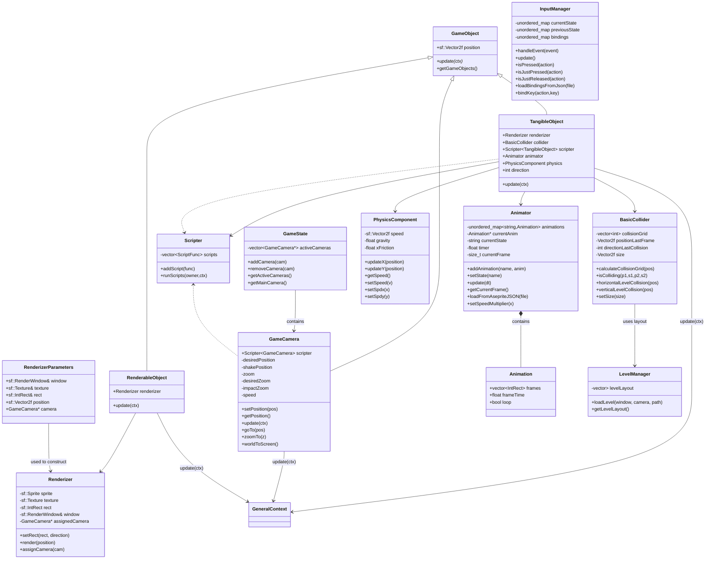

```mermaid
classDiagram
    %% ===============================
    %% Core GameObject hierarchy
    %% ===============================

    class GameObject {
        +sf::Vector2f position
        +update(ctx)*
        +getGameObjects()
    }

    class RenderableObject {
        +Renderizer renderizer
        +update(ctx)
    }

    GameObject <|-- RenderableObject
    GameObject <|-- GameCamera
    GameObject <|-- TangibleObject


    %% ===============================
    %% Renderizer subsystem
    %% ===============================

    class RenderizerParameters {
        +sf::RenderWindow& window
        +sf::Texture& texture
        +sf::IntRect& rect
        +sf::Vector2f position
        +GameCamera* camera
    }

    class Renderizer {
        -sf::Sprite sprite
        -sf::Texture texture
        -sf::IntRect rect
        -sf::RenderWindow& window
        -GameCamera* assignedCamera
        +setRect(rect, direction)
        +render(position)
        +assignCamera(cam)
    }

    RenderableObject --> Renderizer
    RenderizerParameters --> Renderizer : used to construct


    %% ===============================
    %% TangibleObject subsystem
    %% ===============================
    class TangibleObject {
        +Renderizer renderizer
        +BasicCollider collider
        +Scripter~TangibleObject~ scripter
        +Animator animator
        +PhysicsComponent physics
        +int direction
        +update(ctx)
    }

    TangibleObject --> BasicCollider
    TangibleObject --> Scripter
    TangibleObject --> Animator
    TangibleObject --> PhysicsComponent


    %% ===============================
    %% Animator subsystem
    %% ===============================

    class Animator {
        +addAnimation(name, anim)
        +setState(name)
        +update(dt)
        +getCurrentFrame()
        +loadFromAsepriteJSON(file)
        +setSpeedMultiplier(x)
        -unordered_map~string,Animation~ animations
        -Animation* currentAnim
        -string currentState
        -float timer
        -size_t currentFrame
    }

    class Animation {
        +vector~IntRect~ frames
        +float frameTime
        +bool loop
    }

    Animator *-- Animation : contains


    %% ===============================
    %% Physics subsystem
    %% ===============================

    class PhysicsComponent {
        -sf::Vector2f speed
        -float gravity
        -float xFriction
        +updateX(position)
        +updateY(position)
        +getSpeed()
        +setSpeed(v)
        +setSpdx(x)
        +setSpdy(y)
    }


    %% ===============================
    %% Collision subsystem
    %% ===============================

    class BasicCollider {
        -vector~int~ collisionGrid
        -Vector2f positionLastFrame
        -int directionLastCollision
        -Vector2f size
        +calculateCollisionGrid(pos)
        +isColliding(p1,s1,p2,s2)
        +horizontalLevelCollision(pos)
        +verticalLevelCollision(pos)
        +setSize(size)
    }

    class LevelManager {
        +loadLevel(window, camera, path)
        +getLevelLayout()
        -vector<vector<int>> levelLayout
    }

    BasicCollider --> LevelManager : uses layout


    %% ===============================
    %% Camera subsystem
    %% ===============================

    class GameCamera {
        +setPosition(pos)
        +getPosition()
        +update(ctx)
        +goTo(pos)
        +zoomTo(z)
        +worldToScreen()
        +Scripter~GameCamera~ scripter
        -desiredPosition
        -shakePosition
        -zoom
        -desiredZoom
        -impactZoom
        -speed
    }

    class GameState {
        +addCamera(cam)
        +removeCamera(cam)
        +getActiveCameras()
        +getMainCamera()
        -vector~GameCamera*~ activeCameras
    }

    GameState --> GameCamera : contains


    %% ===============================
    %% Input subsystem
    %% ===============================

    class InputManager {
        +handleEvent(event)
        +update()
        +isPressed(action)
        +isJustPressed(action)
        +isJustReleased(action)
        +loadBindingsFromJson(file)
        +bindKey(action,key)
        -unordered_map currentState
        -unordered_map previousState
        -unordered_map bindings
    }


    %% ===============================
    %% Scripting subsystem
    %% ===============================

    class Scripter {
        +addScript(func)
        +runScripts(owner,ctx)
        -vector~ScriptFunc~ scripts
    }

    Scripter <.. TangibleObject
    Scripter <.. GameCamera


    %% ===============================
    %% GeneralContext link
    %% ===============================

    class GeneralContext
    TangibleObject --> GeneralContext : update(ctx)
    GameCamera --> GeneralContext : update(ctx)
    RenderableObject --> GeneralContext : update(ctx)
```